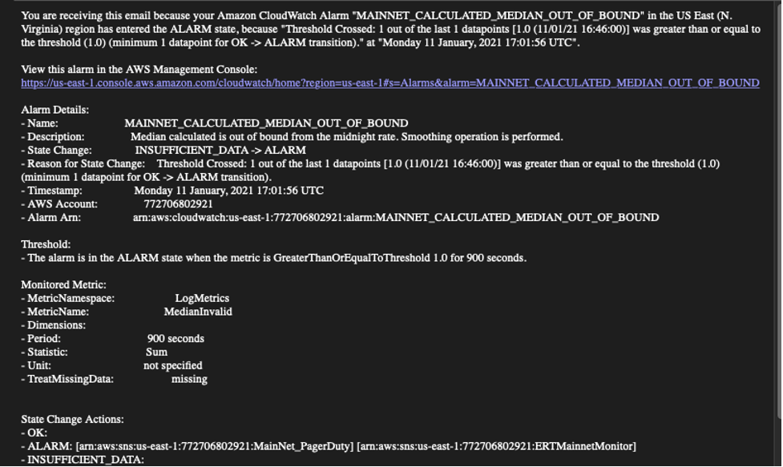
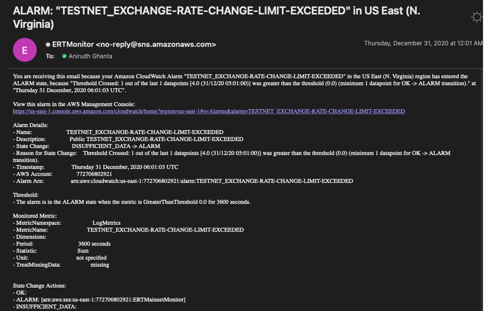
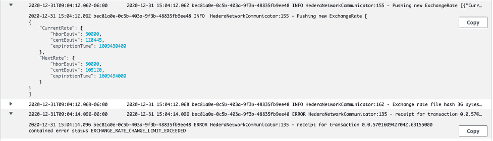
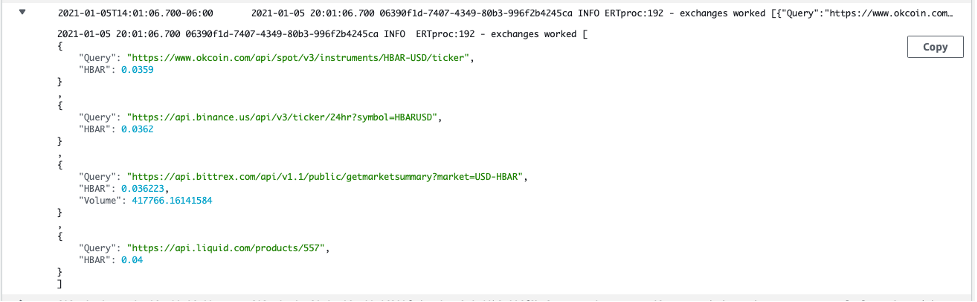
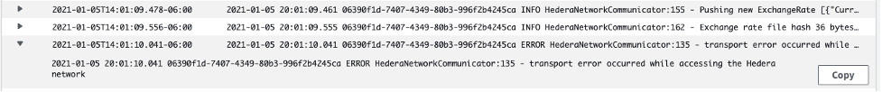

# Triaging ERT Alerts

This Document helps understanding and resolving ERT Alerts sent from AWS CloudWatch/ PagerDuty.

## Identify the Network

Alert specifies a network name in the prefix: MAINNET, TESTNET, PREPROD respectively for 
Mainnet, TestNet and Pre-Production networks. 

For example:
This is an alert from Mainnet ERT saying that the Exchange Rate Update transaction sent to the Mainnet Nodes came back 
with the status MAINNET_CALCULATED_MEDIAN_OUT_OF_BOUND.

This is a similar alert from TestNet ERT saying that the Exchange Rate Update transaction sent to the TestNet Nodes 
came back with status TESTNET_EXCHANGE_RATE_CHANGE_LIMIT_EXCEEDED.

You can make out from the network and type of error from Name and Description under Alarm Details.

## Types of Alerts

*	INSUFFICIENT_PAYER_BALANCE
Account 0.057 on the corresponding network doesn’t have enough balance to do the Exchange Rate File update transaction.

*	EXCHANGE_RATE_CHANGE_LIMIT_EXCEEDED
The exchange rate computed is off the specified delta from the precious midnight rate on the nodes.

*	CALCULATED_MEDIAN_OUT_OF_BOUND
The median calculated from the retrieved exchange rates from various exchanges like bittrex, binance, okcoin ... 
is out of bound from the midnight rate.

*	FAILED_TO_GET_LATEST_ADDRESS_BOOK
The query to get the latest address book from the database that ERT uses [AWS RDS] failed.

*	ERROR_BUILDING_HEDERA_CLIENT
Failed to build Hedera Client that we use to send the Exchange Rate File update transaction.

*	FAILED_TO_LOAD_CONFIGURATION
Failed to load the config file that we got from AWS S3.

*	NO_MEDIAN_COMPUTED
No Median is computed as there are no values to compute from. These values are retired from different exchanges.

*	NO_VALID_EXCHANGE_RATES_RETRIEVED
None of the exchange APIs are working and hence we don’t have any valid exchange rates to compute a median from.

*	FAILED_TO_GET_LATEST_EXCHANGE_RATE_FROM_ERT_DB
Query to get the latest midnight rate from the ERT database failed.

*	FAILED_TO_GET_LATEST_MIDNIGHT_RATE_FROM_ERT_DB
Query to get the exchange rate that we pushed in the last successful run from the ERT database failed.

*	CONFIG_FILE_NOT_FOUND
The specified config file in the ERT lambda environment variables is not found in AWS S3.

*	Failed_After_4_Retries
Currently the max retries is set to 4 per run.
We see this error log if we fail to do a successful transaction within these 4 runs.

## Get to the Logs
*   [Mainnet](https://console.aws.amazon.com/cloudwatch/home?region=us-east-1#logsV2:log-groups/log-group/$252Faws$252Flambda$252Fexchange-rate-tool-lambda-mainnet)
*   [TestNet](https://console.aws.amazon.com/cloudwatch/home?region=us-east-1#logsV2:log-groups/log-group/$252Faws$252Flambda$252Fexchange-rate-tool-lambda-testnet)
*   [PreProd](https://console.aws.amazon.com/cloudwatch/home?region=us-east-1#logsV2:log-groups/log-group/$252Faws$252Flambda$252Fexchange-rate-tool-lambda-integration)

## Resolutions

*   EXCHANGE_RATE_CHANGE_LIMIT_EXCEEDED
    
    Check for the log for the first occurrence of EXCHANGE_RATE_CHANGE_LIMIT_EXCEEDED 
    and note the Exchange rates we tried to push on that run. 
    
    

    Say this happened on 30th Nov at 7 pm. 
    Note the Exchange rates successfully pushed on 29th Nov at 11 pm so that we have the midnight rates for the run that
    got us EXCHANGE_RATE_CHANGE_LIMIT_EXCEEDED.

    Validate the delta and check if it is under 25%.

    Note that, if the transaction on the last midnight failed, then the midnight rates for ERT and the nodes will the different. 
    There are 2 ways to resolve this EXCHANGE_RATE_CHANGE_LIMIT_EXCEEDED error.

    1.	Wait it out. Wait until next midnight and if the transaction is successful this will automatically be resolved. 
    2.	If you this that next midnight transaction will fail again because of high volatility in the rates, 
        do a manual override of the midnight rate by sending an Exchange Rate File update using account 0.0.50.

*   INSUFFICIENT_PAYER_BALANCE
    
    Fund the account 0.0.57 on the appropriate network.

*   CALCULATED_MEDIAN_OUT_OF_BOUND
    
    From the logs check the values retrieved from the exchanges.
    
    
    
    Check if the retrieved values make sense and are consistent with each other.
    
*   FAILED_TO_GET_LATEST_ADDRESS_BOOK, FAILED_TO_GET_LATEST_MIDNIGHT_RATE_FROM_ERT_DB and FAILED_TO_GET_LATEST_EXCHANGE_RATE_FROM_ERT_DB
    
    The Query to the ERT database on AWS RDS failed. Use DataGrip or any tool to look at the database.
    If needed fix the latest addressBook/exchangeRate/midnightRate record from the appropriate table.
    If the query is at fault, you can use the tool to run the query and debug it.

*   ERROR_BUILDING_HEDERA_CLIENT
    
    SDK might have changed and rendered the current method to build a client useless.
    Check with the dev team to update the code.

*   FAILED_TO_LOAD_CONFIGURATION
    The config.txt linked to the lambda in AWS S3 might have a data in the wrong format.
    Please check if the file is a valid Json.

*   NO_MEDIAN_COMPUTED and NO_VALID_EXCHANGE_RATES_RETRIEVED
    
    Both of these alerts are most likely to occur together.
    Validate from the logs that none of the exchanges sent us any valid data back.
    The APIs to get the exchange rates might have changed, pelase check the appropriate exchange board for updates.

*   CONFIG_FILE_NOT_FOUND
    
    Path to Config.txt might be wrong or the file might have been moved from the specified s3 bucket 
    in the AWS Lambda environment variable. Please correct and retry.

*   Failed_After_4_Retries
    
    This error might be accompanied by any one of the above alerts.
    If this is triggered alone, then the most possible reason for the error is that the 
    transaction is failed because of transport error to the hedera node.
    
    
    
    Usually, the transaction eventually succeeds by trying on different nodes, 
    but as we have a limit on 4 retries per run, rerunning the lambda would help. 
    We need to increase the retry size and update the metric to look the right error message or 
    fix the communication error between ERT and specific nodes that failed. 
